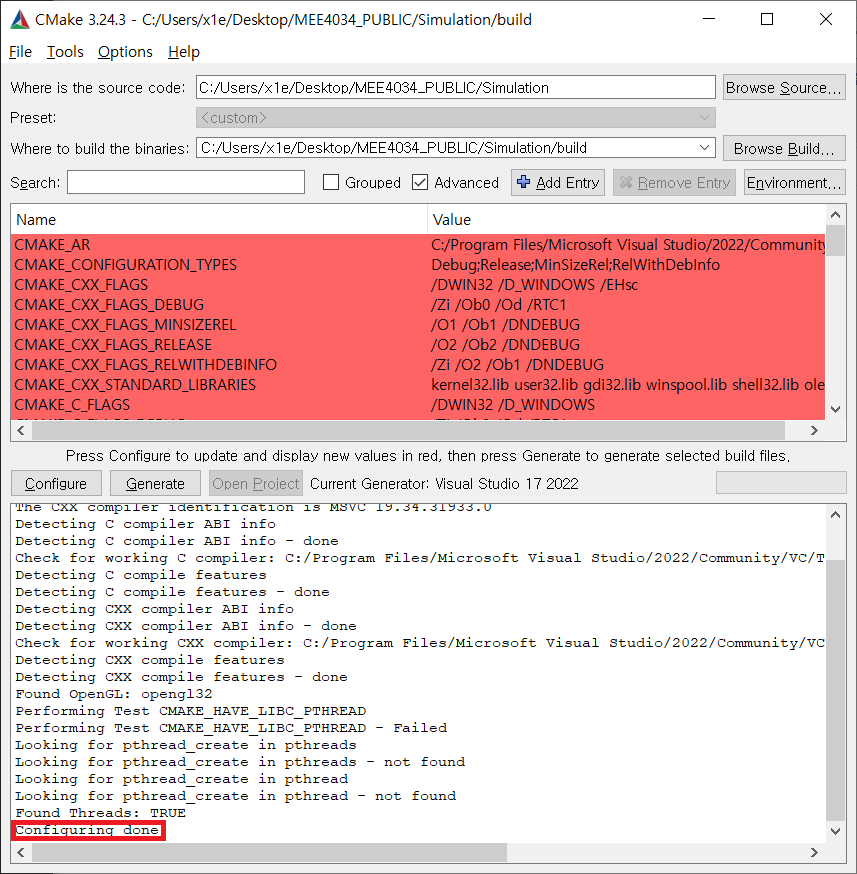

# MEE4034_PUBLIC
본 저장소는 이성온 교수님의 제어시스템설계(MEE4034) 과목의 두 번째 실습과 관련된 문서 및 프로젝트 파일을 공유하기 위해 생성되었습니다.

* * *
## 준비하기
### 1. 설치(클릭 시 이동)
* [Visual Studio Community](https://visualstudio.microsoft.com/ko/vs/community/): C++ 컴파일러(MSVC v142)<sup>1</sup> 및 통합 개발환경<sup>2</sup>
    > VS2017(v140), VS2019(v141)에서도 정상동작함을 확인하였습니다.
    
* [CMake](https://github.com/Kitware/CMake/releases/download/v3.25.0/cmake-3.25.0-windows-x86_64.msi): Cross-Platform 빌드시스템 관리 툴
    > 3.25(latest): https://cmake.org/

* 설치옵션 안내: [Visual Studio 2022](https://github.com/Robotics-and-Intelligence-Lab/MEE4034_PUBLIC/tree/main/docs/INSTALL_VS.md), [CMake](https://github.com/Robotics-and-Intelligence-Lab/MEE4034_PUBLIC/tree/main/docs/INSTALL_CMAKE.md)

### 2. 저장소 복제 및 프로젝트 구성/생성
* 저장소 복제

    저장소에서 [Download ZIP](https://github.com/Robotics-and-Intelligence-Lab/MEE4034_PUBLIC/archive/refs/heads/main.zip)을 클릭하여 프로젝트 압축 파일을 다운로드 후 압축해제합니다.

    이 과정을 마친 후 MEE4034_PUBLIC 폴더 내에 다음과 같은 파일이 위치해있는지 확인합니다.
    ```
    MEE4034_PUBLIC
    - Experiment
    - Share
    - Simulation
    - ...
    ```
* CMake를 이용한 프로젝트 구성/생성 
    > 경로에 한글이 포함된 경우 문제가 발생할 수 있습니다. 예) C:/연습/MEE4034_PUBLIC/...
    1. Simulation 폴더 내에 `build` 폴더를 생성합니다.
    2. CMake를 실행한 후 
        
        `Where is the source code`란에는 Simulation 폴더의 경로를 입력하고, (`Browse Source...` 기능 활용)
        
        `Where to build the binaries`란에는 Simulation/build 폴더의 경로를 입력합니다. (`Browse Build...` 기능 활용)
    3. `Configure` 버튼을 클릭합니다.
    4. `Specify the generator for this project`란에 자신이 설치한 Visual Studio 버전을 선택(Visual Studio 17 2022)한 뒤, `Finish` 버튼을 눌러서 프로젝트 구성이 완료되도록 합니다.

        </img>

        > 이 과정에서 문제가 없어야 합니다.
    5. `Generate` 버튼을 클릭 및 `Open Project` 버튼을 클릭하여 Visual Studio을 실행시키고 `Ctrl + F5`의 단축키를 눌러서 `Simulation` 파일을 실행합니다.

        </img>

        > Simulation/build 폴더 내에 솔루션 파일(`Simulator.sln`)을 더블클릭하여 생성된 프로젝트에 언제든 접근할 수 있습니다. 

***
## 시작하기
시뮬레이션을 구성하는 관련된 모든 물리적 정보(중력, 회전관성, 속도 등)는 [MuJoCo](https://mujoco.org/)라는 물리엔진 라이브러리에 의해 관리됩니다. 
> `Simulation/thirdparty/mujoco` 안에 해당 물리엔진 라이브러리 파일이 존재하며, CMake로 프로젝트 구성 시 자동으로 링크가 되도록 설정되어 있습니다. (MuJoCo를 직접 다운로드 할 필요가 없음)

프로젝트 및 소스 파일을 별도로 수정하지 않았다면 다음의 조건으로 물리엔진이 시뮬레이션 하도록 설정되어 있습니다.

* `step size`: 100us
* `gravity constant`: 9.81m/s<sup>2</sup>
* `solver`: Runge-Kutta method(RK4)
* `fps`: 60FPS (시뮬레이션 시간 기준)

여기서 한가지 짚고 넘어갈 중요한 부분은 컴퓨터 연산성능 차이에 따라 물리엔진이 시뮬레이션 스텝을 수행하는 실제 시간이 달라진다는 점 입니다. 간혹 이 시간 간격이 매우 짧은 경우가 존재하였는데, `최대 프레임 속도` 제한 기능을 통해 이러한 문제를 임시로 해결할 수 있습니다.

예1) NVIDIA 그래픽카드 제품으로 구성된 시스템의 경우
> NVIDIA 제어판 - 3D 설정 관리 - 최대 프레임 속도 - 60FPS - 적용

예2) 라데온 그래픽카드 제품으로 구성된 시스템의 경우
> 라데온 아드레날린 - 그래픽 - 최소/최대 FPS: 60FPS

- - -
### 1. 관측시간과 관측주기
`Simulator.sln` 솔루션을 클릭 한 뒤, `Ctrl+F5`의 단축키를 통해 시뮬레이션을 수행해보면 다음과 같이 두 숫자가 콘솔창에 반복되어 출력되는 것을 볼 수 있습니다.
```
...
[2.532700] dt:0.001000
[2.533700] dt:0.001000
[2.534700] dt:0.001000
[2.535700] dt:0.001000
[2.536700] dt:0.001000
[2.537700] dt:0.001000
...
```
* 관측시간: 앞의 숫자는 관측시간(혹은 시뮬레이션 시간)에 해당합니다. 물리엔진이 별도로 관리하고 있는 시간(단위: 초)에 해당합니다.
    > 실행한 이후로 얼마나 시간이 흘렀나요?
* 관측주기: 뒤의 숫자는 관측주기에 해당합니다. 이후 제어기의 제어 명령(예: 토크)이 dt(0.001초) 간격으로 수행될 것임을 유추할 수 있습니다.
    > 얼마마다 제어 입력이 계산되나요?

현재 실행된 프로그램은 관측시간이 3초가 되면 종료하게 끔 작성되어 있습니다.
다음의 과정을 통해 이 시간을 약간 늘려보도록 합시다.

* Visual Studio(`Simulator.sln`)에서 `솔루션 탐색기`(단축키 `Ctrl+Alt+L`)를 열기
* Simulator - Source Files - main.cpp을 더블클릭
* `main.cpp`의 최상단에 있는 `TOTAL_SIM_TIME`을 5로 변경

    (변경전)
    ```cpp
    #define TOTAL_SIM_TIME 3 // [s]
    ```
    (변경후)
    ```cpp
    #define TOTAL_SIM_TIME 5 // [s]
    ```
* 변경사항 저장(`Ctrl+S`)

`Ctrl+F5`의 단축키를 눌러서 변경된 결과를 확인하세요.

```
...
[4.874200] dt:0.001100
[4.875300] dt:0.001100 
[4.876400] dt:0.001100
[4.877500] dt:0.001100 
[4.878600] dt:0.001100
...
```
## :beers:

### 2. 각도 정보 획득
(프로그래밍 관점에서) 제어를 수행하는 단계는 크게 3단계로 구성되어 있습니다.

* 센서 정보 획득
* 오차 계산 및 제어 명령(전압,토크 등) 계산
* 제어 명령 전달

또한 이 과정이 시스템이 종료되기 전까지 **반복**되기 때문에 특별히 이를 수행하는 구문에 대한 별칭을 붙었는데, `제어 루프(loop)`가 이에 해당합니다.

우리 시뮬레이션의 경우 `Callback`이라 이름 붙여준 함수가 `제어 루프(loop)`에 대응됩니다. 
> 앞의 예제에서 특정 주기(dt)로 콘솔창에 시간이 **반복**해서 출력되었던 이유는 `Callback` 때문입니다.


다시 본론으로 돌아와서, 제어 loop의 첫 단계에 해당하는 센서 정보 획득을 수행해봅시다.
> 콘솔 창에 관절의 각도 정보를 출력

아래의 과정을 통해 이를 수행할 수 있습니다.

* `main.cpp`의 `Callback` 함수를 다음과 같이 변경

    (변경전)
    ```cpp
    /** 제어 Loop에 해당합니다. (DeltaTime: [s])*/
    void Callback(double DeltaTime)
    {
        // Simulation 시간 및 제어 loop 경과 시간을 표기합니다.
        printf("[%f] dt:%.6f\n", Env.GetSimulationTime(), DeltaTime);

    }
    ```

    (변경후)
    ```cpp
    double Q[2]; // 관절이 2개

    /** 제어 Loop에 해당합니다. (DeltaTime: [s])*/
    void Callback(double DeltaTime)
    {
        // Simulation 시간 및 제어 loop 경과 시간을 표기합니다.
        printf("[%f] dt:%.6f\n", Env.GetSimulationTime(), DeltaTime);

        Env.GetJointPosition(Q); // 관절 정보 획득	
        printf("%f, %f\n", Q[0], Q[1]); // 출력
    }
    ```

    > 당장 `Q[2]`, `%f` 등의 문법적인 부분을 모르신다고 해도 걱정하지 않아도 됩니다.

저장(`Ctrl+S`) 후 실행(`Ctrl+F5`)할 경우 다음과 같은 결과를 확인할 수 있습니다.   

```
[3.547700] dt:0.001000
-2.956427, -0.446790
[3.548700] dt:0.001000
-2.965494, -0.455255
[3.549700] dt:0.001000
-2.974493, -0.463772
[3.550700] dt:0.001000
-2.983423, -0.472339
[3.551700] dt:0.001000
-2.992283, -0.480955
```
> 각도의 단위는 라디안(rads)입니다.

## :beers:

### 3. 토크 명령 전달
흐름 상 오차를 계산하는 예제가 위치하는 것이 적합하지만, 조금 더 단순한 예제인 토크 명령을 전달하는 과정부터 수행해봅시다.

마찬가지로 `main.cpp`을 수정합니다.

(변경전)
```cpp
double Q[2];

/** 제어 Loop에 해당합니다. (DeltaTime: [s])*/
void Callback(double DeltaTime)
{
    // Simulation 시간 및 제어 loop 경과 시간을 표기합니다.
    printf("[%f] dt:%.6f\n", Env.GetSimulationTime(), DeltaTime);

    Env.GetJointPosition(Q); // 관절 정보 획득	
    printf("%f, %f\n", Q[0], Q[1]); // 출력
}
```

(변경후)
```cpp
double Q[2];
double T[2]; // torque

/** 제어 Loop에 해당합니다. (DeltaTime: [s])*/
void Callback(double DeltaTime)
{
    // Simulation 시간 및 제어 loop 경과 시간을 표기합니다.
    printf("[%f] dt:%.6f\n", Env.GetSimulationTime(), DeltaTime);

    Env.GetJointPosition(Q); // 관절 정보 획득	
    printf("%f, %f\n", Q[0], Q[1]); // 출력

    T[0] = 0.1; // 첫 번째 관절
    T[1] = 0.1; // 두 번째 관절
    Env.SetJointTorque(T); // 토크 명령 전달!
}
```

저장(`Ctrl+S`) 후 실행(`Ctrl+F5`)할 경우 다음과 같은 결과를 확인할 수 있습니다.   

```
[4.996300] dt:0.001100
93.963408, 99.597435
[4.997400] dt:0.001100
93.977628, 99.718047
[4.998500] dt:0.001100
93.984971, 99.844580
[4.999600] dt:0.001100
93.985809, 99.977012
```
> 토크의 단위는 (Nm)입니다.

## :beers:

### 4. 오차 계산 및 제어 수행
`제어 루프(loop)`의 두 번째 단계에 해당하는 오차를 계산하고 이에 적합한 토크를 계산 및 적용해봅시다.

오차를 계산하려면 목표부터 설정되어 있어야 합니다.
> 예) $q_1=\pi/2, q_2=\pi/2$

(편의상 𝝿: 3.14로 간주)

이번에 진행될 예제도 마찬가지로 `main.cpp` 파일을 수정하는 방식으로 진행됩니다.

* 우선 관절 목표를 기록합니다.
    ```cpp
    ... (생략)
    double Q_D[2] = {3.14/2, 3.14/2}; // Q desired

    double Q[2];
    double T[2]; // torque
    ... (생략)
    ```
* 관절 목표와 현재 관절 값 간의 차이를 계산합니다.
    ```cpp
    ... (생략)
    double Q_E[2]; // Q error
    ... (생략)
    Q_E[0] = Q_D[0] - Q[0];
    Q_E[1] = Q_D[1] - Q[1];
    ```

    > 이 내용이 어디에 입력되어야 할까요?

    이 예제의 경우 `Q_D`가 바뀔 필요가 없습니다. 하지만 `Q_E`는 매 순간 재계산 되어야합니다. (`Q`가 매 순간 변하기 때문)

    따라서, `Q_E`를 계산하는 부분은 관절 정보(`Q`)를 획득하고 난 뒤에 위치하는 것이 가장 적절합니다.

* 오차에 비례해서 토크를 입력합니다.

  ```cpp    
  ... (생략)
  T[0] = Q_E[0] * 0.3;
  T[1] = Q_E[1] * 0.2;
  Env.SetJointTorque(T);
  ... (생략)
  ```

내용이 길어졌기 때문에 변경전/후를 비교하자면 다음과 같습니다.

(변경전)
```cpp
double Q[2];
double T[2]; // torque

/** 제어 Loop에 해당합니다. (DeltaTime: [s])*/
void Callback(double DeltaTime)
{
    // Simulation 시간 및 제어 loop 경과 시간을 표기합니다.
    printf("[%f] dt:%.6f\n", Env.GetSimulationTime(), DeltaTime);

    Env.GetJointPosition(Q); // 관절 정보 획득	
    printf("%f, %f\n", Q[0], Q[1]); // 출력

    T[0] = 0.1; // 첫 번째 관절
    T[1] = 0.1; // 두 번째 관절
    Env.SetJointTorque(T); // 토크 명령 전달!
}
```

(변경후)
```cpp
double Q_D[2] = { 3.14 / 2, 3.14 / 2 }; // Q desired
double Q_E[2]; // Q error
double Q[2];
double T[2];

/** 제어 Loop에 해당합니다. (DeltaTime: [s])*/
void Callback(double DeltaTime)
{
	// Simulation 시간 및 제어 loop 경과 시간을 표기합니다.
	printf("[%f] dt:%.6f\n", Env.GetSimulationTime(), DeltaTime);

	Env.GetJointPosition(Q);	
	printf("%f, %f\n", Q[0], Q[1]); // 출력

	Q_E[0] = Q_D[0] - Q[0];
	Q_E[1] = Q_D[1] - Q[1];
	T[0] = Q_E[0] * 0.3;
	T[1] = Q_E[1] * 0.2;
	Env.SetJointTorque(T);
}
```

저장(`Ctrl+S`) 후 실행(`Ctrl+F5`)할 경우 목표 위치를 기준으로 시스템이 왕복하는 것을 볼 수 있습니다.

> `//` 뒤의 문자들은 `주석(comment)`에 해당하며 프로그램에 영향을 주지 않습니다.

## 마무리
우리는 이 문서에서 프로젝트를 구성<sup>1</sup>하고 첫 번째 제어를 수행<sup>2</sup>하는 과정에 이르기까지 몇 가지 개념적인 부분<sup>3</sup>을 다루고 직접 실습해보았습니다. 
다음 [문서](https://github.com/Robotics-and-Intelligence-Lab/MEE4034_PUBLIC/blob/main/docs/TUTORIAL01.md)에서는 조금 더 체계적이고 분석적인 접근을 하기위한 몇 가지 기능들을 추가적으로 다뤄보도록 하겠습니다.

# :beers:

[Robotics & Intelligence Lab](http://rilab.hanyang.ac.kr/wordpress/)
