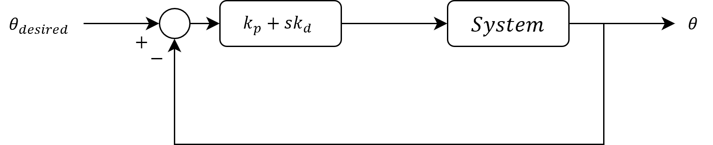
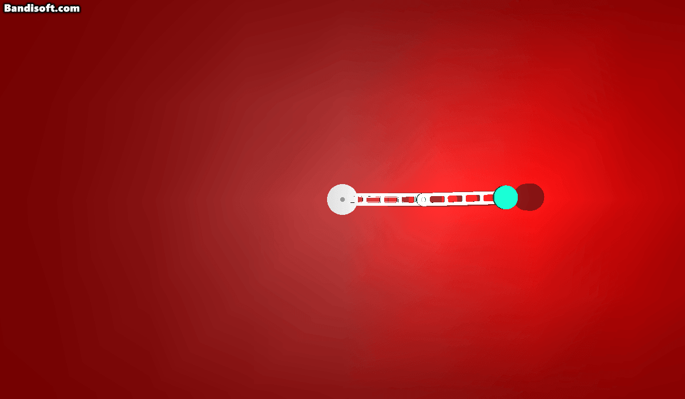
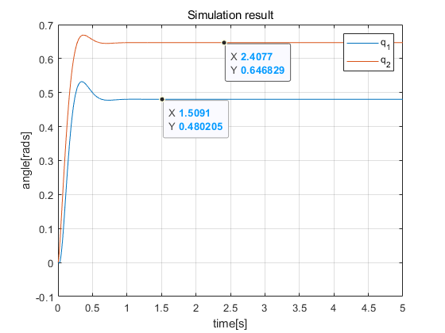
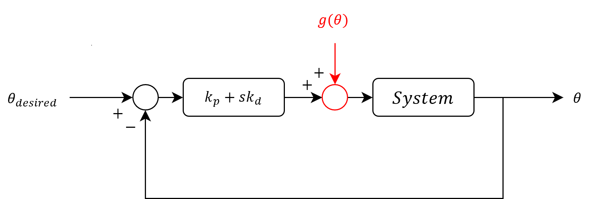
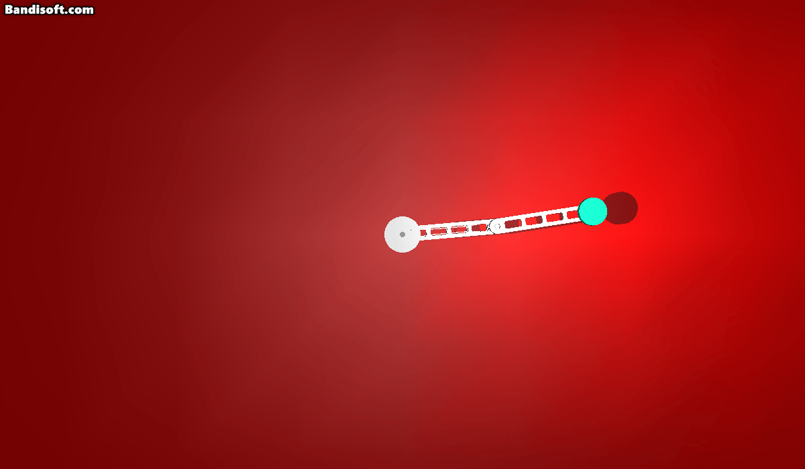
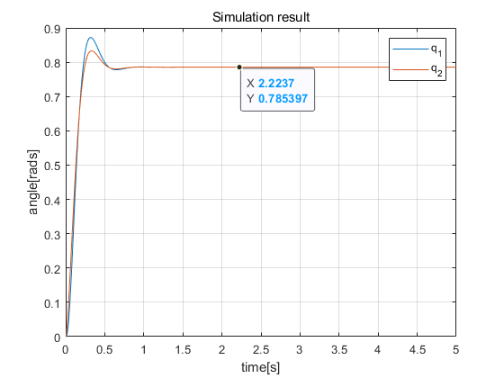
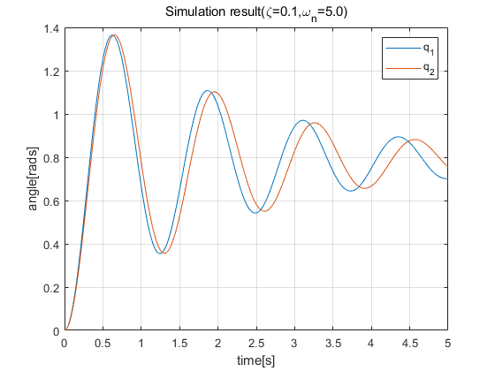
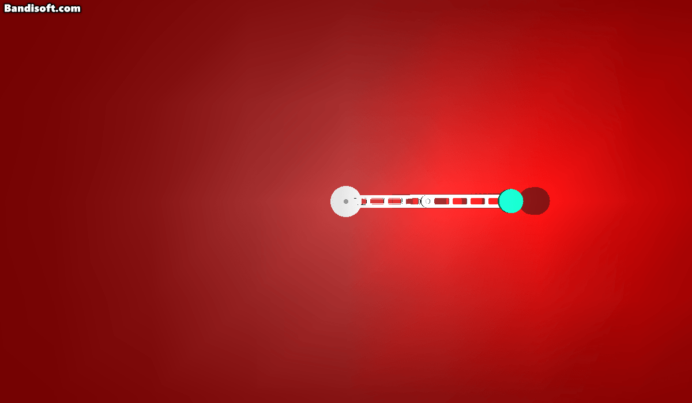
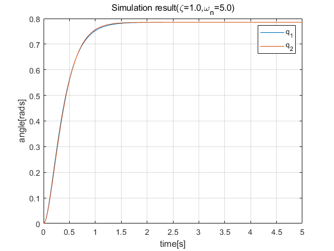
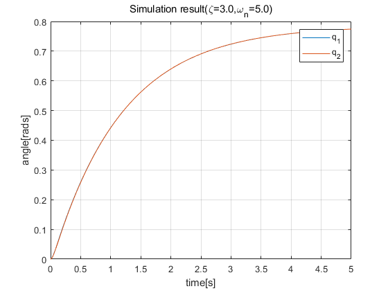

# Tutorial 01
## 목표
아래와 같이 총 3가지 유형의 제어기를 직접 구현합니다.

+ PD 제어기 ( $\tau=k_p\theta_e + k_d\dot{\theta_e}$ )
+ PD 제어기 + 중력보상 ( $\tau=k_p\theta_e + k_d\dot{\theta_e} + g(\theta)$ )
+ Inverse dynamics 제어기 ( $\tau=M(\theta)(\ddot{\theta_d}+k_1\dot{\theta_e}+k_0\theta_e) + c(\theta, \dot{\theta}) + g(\theta)$ )

## 기초
토크 입력( $\tau$ )과 
시스템의 상태 변수( $\theta, \dot{\theta}, \ddot{\theta}$ )을 나타내는 함수 $f$는 다음과 같습니다.

$\tau=f(\theta,\dot{\theta},\ddot{\theta})=M(\theta)\ddot{\theta}+c(\theta,\dot{\theta})+g(\theta)$

이번 문서의 목적은 목표 각도( $\theta_d$ )가 주어졌을 때 이를 달성하기 위한 제어기를 직접 구현하는 것입니다. 

제어기를 구현하기 전에 `main.cpp` 파일을 보면 크게 4가지 영역으로 나뉘어져 있음을 확인할 수 있습니다.

+ 전처리기 지시자 영역
    ```c++
    #include <iostream>
    ...(중략)
    #define CONTROL_FREQ 1000
    #define TOTAL_SIM_TIME 5
    ```
+ 전역변수 정의 영역
    ```c++
    UEnvironmentManager Env; // env instance
    ...(중략)
    double Q[2];
    ...(중략)    
    ```
+ Callback 함수
    ```c++
    void Callback(double DeltaTime)
    {
        ...(중략)        
    }
    ```
+ main 함수
    ```c++
    int main(int argc, char** argv)
    {
        ...(중략)
    }
    ```

빠른 구현을 위해 `전처리기 지시자 영역` 및 `전역변수 정의 영역`을 다음과 같이 변경합니다.

+ `전처리기 지시자 영역` (변경전)
    ```c++
    #include <iostream>
    #include "EnvironmentManager.h"
    #include "SimpleLogger.h"
    #include "DynamicsUtils.h"
    #include "MathUtils.h"

    #define CONTROL_FREQ 1000 // [Hz]
    #define TOTAL_SIM_TIME 5 // [s]
    ```

+ `전역변수 정의 영역` (변경후)
    ```c++
    UEnvironmentManager Env; // env instance
    USimpleLogger Log("log");
    UDynamicsUtils DUtils;

    double Q_D[2] = { DEG2RAD(45.0), DEG2RAD(45.0) }; // 목표(각도)
    double V_D[2] = { 0, 0 }; // 목표(각속도)
    double A_D[2] = { 0, 0 }; // 목표(각가속도)

    double Q[2]; // 현재(각도)
    double V[2]; // 현재(각속도)

    double Q_E[2]; // 오차(각도)
    double V_E[2]; // 오차(각속도)
    
    double T[2]; // 토크(Nm)

    double Temp1[2]; // 연산결과 임시 저장 공간1
    double Temp2[2]; // 연산결과 임시 저장 공간2
    ```

## PD Control
첫 번쨰 제어기는 PD Controller 입니다. 목표를 달성하기 위해 다음과 같은 방식으로 토크( $\tau$ )를 모터에 전달합니다.

$\tau=k_p(\theta_d-\theta)+k_d(\dot{\theta_d}-\dot{\theta})=k_p\theta_{err}+k_d\dot{\theta_{err}}$

이에 대한 Blockdiagram은 다음과 같습니다.

</img>

다음과 같은 Gain을 갖는 PD 제어기를 설계해봅시다.
> $k_p=1.0, k_d=0.1$

제어기의 구현은 `Callback 함수`에서 이루어지며, 본 문서에서는 `Vec2D(배열)`의 연산을 도와주는 `UMathUtils`를 활용하여 구현해보도록 하겠습니다.

```c++
void Callback(double DeltaTime)
{
    Env.GetJointPosition(Q);
    Env.GetJointVelocity(V);

    UMathUtils::Vec2Sub(Q_D, Q, Q_E); // Q_E = Q_D - Q
    UMathUtils::Vec2Sub(V_D, V, V_E); // V_E = V_D - V

    UMathUtils::Vec2Mult(Q_E, 1.0, Q_E); // Q_E = Q_E * 1.0 
    UMathUtils::Vec2Mult(V_E, 0.1, V_E); // V_E = V_E * 0.1

    UMathUtils::Vec2Add(Q_E, V_E, T); // T = Q_E * 1.0 + V_E * 0.1
    Env.SetJointTorque(T);
}
```

> UMathUtils::Vec2Sub( $\mathbb{x_1}$, $\mathbb{x_2}$, $\mathbb{x_3}$ )의 경우 $\mathbb{x_1} - \mathbb{x_2}$의 결과를 $\mathbb{x_3}$에 저장하는 함수입니다. ( $\mathbb{x_1}$, $\mathbb{x_2}$, $\mathbb{x_3}$는 모두 길이가 2인 배열 )

실행 결과는 다음과 같습니다.

</img>

## Data Logging & Plotting

이어서 아래와 같은 그래프를 출력하기 위해 데이터( $t, \theta_1, \theta_2$ )를 매 제어 루프마다 기록해보도록 하겠습니다.

</img>

우선, `main 함수`의 첫 번째 줄에 다음의 코드를 추가합니다.
```c++
int main(int argc, char** argv)
{
    Log.Init();
    ...(중략)
}
```

이어서 시간( $t$ )을 획득하기 위해 `Callback 함수`의 첫 번째 줄에 다음의 코드를 추가합니다.
```c++
void Callback(double DeltaTime)
{
    double CurrentTime = Env.GetSimulationTime(); // 현재 시간을 받아옵니다.
    ...(중략)
}
```

마지막으로 그래프를 출력하기 위한 데이터를 기록하기 위해 `Callback 함수`의 마지막 줄에 다음의 코드를 추가합니다.
```c++
void Callback(double DeltaTime)
{
    ...(중략)
    Log.Append(CurrentTime, Q);
}
```
> `CurrentTime`은 시간 $t$에 대응되며, `Q`는 $(\theta_1, \theta_2)$의 값이 저장된 배열에 해당합니다.

`Ctrl+F5`를 통해 프로그램을 실행시킬 경우 다음과 같은 결과가 나왔다면 데이터가 성공적으로 기록된 것입니다.
```
File path: log.txt
[Logger]progress: 1/4737
[Logger]progress: 2/4737
[Logger]progress: 3/4737
(중략)
[Logger]progress: 4736/4737
[Logger]progress: 4737/4737
[Logger]data successfully saved. file path: log.txt
```
위 과정이 정상적으로 수행된 경우 `MEE4034_PUBLIC\Simulation\build` 폴더 내에서 `log.txt` 파일을 찾아볼 수 있고 내용은 다음과 같습니다.
```
0.000000 0.000000 0.000000
0.001000 -0.000033 0.000181
0.002000 -0.000132 0.000618
(중략)
4.997400 0.480216 0.646829
4.998500 0.480216 0.646829
4.999600 0.480216 0.646829
```
데이터를 구성하는 각 열은 순서대로 $t, \theta_1, \theta_2$로 되어있고, 약 `0.001`초의 간격으로 데이터가 수집되었음을 확인할 수 있습니다.

`log.txt` 파일의 구성은 `MATLAB`에서 다루기 쉬운 구성에 해당하며, 해당 파일을 시각화하기 위해 `MEE4034_PUBLIC\Scripts`로 `log.txt` 파일을 복사한 뒤, `log_viewer.m` 파일을 `MATLAB`에서 실행합니다.

결과는 다음과 같으며, 데이터를 클릭해 볼 경우 두 관절 모두 목표 각도인 $\pi/4=0.785398$에 도달하지 못하였음을 확인할 수 있습니다.

</img>

> `log_viewer.m`에서 `dataHist(:,1)`은 전체 데이터 중 1열의 데이터 벡터에 해당합니다.

## PD Control with Gravity compensation
정상상태 오차(Steady state error)의 근본적인 원인은 동역학 식 ( $\tau=M(\theta)\ddot{\theta}+c(\theta,\dot{\theta})+g(\theta)$ ) 중 $g(\theta)$로 인해 발생합니다.

강의에서 다뤘듯 $\tau=\tau_{pd}+g(\theta)$와 같이 제어 입력을 줄 경우 단순히 제어특성이 좋아질 뿐 아니라 정상상태 오차가 없어집니다. 

$\tau=\tau_{pd}+g(\theta)=k_p\theta_{err}+k_d\dot{\theta_{err}}+g(\theta)$

이에 대한 Blockdiagram은 다음과 같습니다.

</img>

`Callback 함수`의 내용을 일부 수정하여 이를 직접 구현해보도록 하겠습니다. 구현하기에 앞서, `UDynamicsUtils`는 현재의 상태 변수( $\theta, \dot{\theta}$ )를 입력받아 해당 상태에 대응되는 $M(\theta), c(\theta,\dot{\theta}), g(\theta)$를 계산 및 반환하는 역할을 수행합니다. 
> `UDynamicsUtils`는 `DUtils`(변수명)으로 생성되어 있습니다. (`main.cpp`의 12번째 줄 참고)

$g(\theta)$를 계산 및 획득하기 위해 `Callback 함수`를 다음과 같이 수정하세요.
+ 변경전
    ```c++
    void Callback(double DeltaTime)
    {
        double CurrentTime = Env.GetSimulationTime(); // 현재 시간을 받아옵니다.

        Env.GetJointPosition(Q);
        Env.GetJointVelocity(V);
        
        ...(중략)
    }
    ```
+ 변경후
    ```c++
    void Callback(double DeltaTime)
    {
        double CurrentTime = Env.GetSimulationTime(); // 현재 시간을 받아옵니다.

        double G[2]; // g(\theta)를 저장하기 위한 배열 
        Env.GetJointPosition(Q);
        Env.GetJointVelocity(V);
        DUtils.UpdateDynamics(Q, V); // M, c, g를 계산
        DUtils.GetG(G); // 계산된 g를 획득
        
        ...(중략)
    }
    ```

마지막 남은 단계는 최종적으로 계산된 제어 입력( $\tau$ )에 $g(\theta)$를 더해주는 것입니다.

이를 위해 `Callback 함수`를 다음과 같이 수정합니다. 

+ 변경전
    ```c++
    void Callback(double DeltaTime)
    {
        ...(중략)
        UMathUtils::Vec2Add(Q_E, V_E, T); // T = Q_E * 1.0 + V_E * 0.1
        Env.SetJointTorque(T);

        Log.Append(CurrentTime, Q);
    }
    ```
+ 변경후
    ```c++
    void Callback(double DeltaTime)
    {
        ...(중략)
        UMathUtils::Vec2Add(Q_E, V_E, T); // T = Q_E * 1.0 + V_E * 0.1
        UMathUtils::Vec2Add(T, G, T); // T = T + G
        Env.SetJointTorque(T);

        Log.Append(CurrentTime, Q);
    }
    ```

단축키(`Ctrl+F5`)를 통해 프로그램을 실행시킨 결과는 다음과 같습니다.

</img>

아래 그림과 같이 단순히 기존 PD 제어기의 제어 입력( $\tau$ )에 $g(\theta)$를 더해주는 것만으로도 `정상상태 오차`가 제거됨을 확인할 수 있습니다.

</img>

> 일반적으로 계산된 제어 입력에 $g(\theta)$를 더해주는 행위를 `중력보상`이라고 표현합니다.

## Inverse Dynamics Control (Computed Torque Control)
:warning: PD제어기와 다른 제어기입니다.

제대로 된 동역학 모델없이 PD 제어기 + 중력보상을 수행한 경우 `과도기 응답`(Transient response)을 유추하기 어렵습니다. 이러한 이유로 모터 드라이버 업체에서 `Gain 튜닝 자동화` 솔루션을 제품과 함께 제공하는 [사례](https://www.elmomc.com/capabilities/servo-technology/servo-tools/advanced-wizard-tuning/)를 찾아볼 수 있습니다.

제어하고자 하는 시스템에 대한 동역학 모델이 있다는 것은 설계자 입장에서 많은 이점을 취할 수 있다는 것을 의미합니다. 일례로, 시스템이 원하는 `과도기 응답`을 보이도록 제어기를 설계할 수 있습니다. `Inverse Dynamics Control`은 이를 구현하는 방법론 중 한 종류에 해당합니다.


동역학 모델은 앞서 언급했듯이 다음과 같습니다.

$\tau=M(\theta)\ddot{\theta}+c(\theta,\dot{\theta})+g(\theta) \quad \dotsi (1)$

$\tau$를 다음과 같이 설계해봅니다.
> $\tau$의 유도 과정은 학부 과정에서 다루는 내용이 아니므로 자세한 내용은 생략하였습니다.

$\tau=M(\theta)(\ddot{\theta}_d+k_1(\dot{\theta_d}-\dot{\theta})+k_0(\theta_d-\theta))+c(\theta,\dot{\theta})+g(\theta) \quad \dotsi (2)$

(자세히 보면 $(1)$과 $(2)$식의 차이는 $M(\theta)$ 뒤에 곱해진 성분의 차이가 전부입니다)

$(2) \rightarrow (1)$의 결과는 다음과 같습니다.

$M(\theta)(\ddot{\theta}_d+k_1(\dot{\theta_d}-\dot{\theta})+k_0(\theta_d-\theta))+c(\theta,\dot{\theta})+g(\theta)=M(\theta)\ddot{\theta}+c(\theta,\dot{\theta})+g(\theta)$

$\Longleftrightarrow M(\theta)(\ddot{\theta}_d+k_1(\dot{\theta_d}-\dot{\theta})+k_0(\theta_d-\theta))-M(\theta)\ddot{\theta}=0 \quad (이항)$

$\Longleftrightarrow M(\theta)(\ddot{\theta}_d-\ddot{\theta}+k_1(\dot{\theta_d}-\dot{\theta})+k_0(\theta_d-\theta))=0 \quad (동류항)$

$\Longleftrightarrow M(\theta)((\ddot{\theta}_d-\ddot{\theta})+k_1(\dot{\theta_d}-\dot{\theta})+k_0(\theta_d-\theta))=0 \quad \dotsi (3)$

여기서 $\theta_d-\theta$는 정확히 `각도 오차`를 의미합니다.

$\theta_e \stackrel{\text{def}}{=} \theta_d-\theta$로 기호를 정의하여 식 $(3)$을 $\theta_e$에 대해 표현하면 다음과 같습니다.

$\Longrightarrow M(\theta)(\ddot{\theta}_e+k_1\dot{\theta_e}+k_0\theta_e)=0 \quad \dotsi (4)$

미분방정식 $(4)$를 풀기 위해 양변의 좌측에 $M(\theta)$의 역행렬 $M(\theta)^{-1}$을 곱한 뒤, `라플라스 변환(Laplace transform)`을 취해봅니다.
> 계산의 편의를 위해 초기값은 모두 0으로 가정합니다. ( $\theta_e(0^-), \dot{\theta_e}(0^-), \ddot{\theta_e}(0^-)$ )=( ${0_{2\times1},0_{2\times1},0_{2\times1}}$ )

$\Longrightarrow (s^2+k_1s+k_0)\Theta_e(s)=0 \quad \dotsi (5)$

이 식이 의미하는 바는 상당히 중요한데, $\Theta_e(s)$의 역변환치 $\theta_e(t)$가 시간에 따라 어떻게 변화하는 지는 전적으로 $\Theta_e(s)$에 대한 `특성방정식` $(s^2+k_1s+k_0)=0$에 의존한다는 것을 의미합니다.

결론만 간단히 이야기하자면, 제어 입력을 식 $(2)$와 같이 입력한 경우 각도 오차( $\theta_e$ )의 특성은 식 $(5)$을 따릅니다.

> $(2)\space\tau=M(\theta)(\ddot{\theta}_d+k_1(\dot{\theta_d}-\dot{\theta})+k_0(\theta_d-\theta))+c(\theta,\dot{\theta})+g(\theta)$

---
제어기의 구현 및 검증을 위해 `Callback 함수`의 앞 부분을 다음과 같이 변경합니다.

( $M(\theta), c(\theta, \dot{\theta})$를 계산 및 획득 )
```c++
void Callback(double DeltaTime)
{
    double CurrentTime = Env.GetSimulationTime(); // 현재 시간을 받아옵니다.

    double M[2][2];
    double C[2];
    double G[2];

    Env.GetJointPosition(Q);
    Env.GetJointVelocity(V);
    DUtils.UpdateDynamics(Q, V); // M, c, g를 계산

    DUtils.GetM(M); // 계산된 M을 획득
    DUtils.GetC(C); // 계산된 c를 획득
    DUtils.GetG(G); // 계산된 g를 획득
    ...(중략)
}
```

제어 입력은 식 $(2)$와 같고, 이해를 돕기 위해 다음의 순서로 해당 값을 계산합니다. 
* $temp_1=M(\theta)(\ddot{\theta}_d+k_1(\dot{\theta_d}-\dot{\theta})+k_0(\theta_d-\theta))$

* $temp_2=c(\theta,\dot{\theta})+g(\theta)$

* $\tau=temp_1+temp_2$

> $k_1 = 0.1, k_0=1.0$ (임시)

`Callback 함수` 본문에 순서대로 해당 내용을 구현합니다.

+ `Temp1` 계산
    ```c++
    void Callback(double DeltaTime)
    {
        ...(중략)
        UMathUtils::Vec2Sub(Q_D, Q, Q_E); // Q_E = Q_D - Q
        UMathUtils::Vec2Sub(V_D, V, V_E); // V_E = V_D - V

        double K1 = 0.1;
        double K0 = 1.0;

        UMathUtils::Vec2Mult(Q_E, K0, Q_E); // Q_E * K0
        UMathUtils::Vec2Mult(V_E, K1, V_E); // V_E * K1
        
        UMathUtils::Vec2Add(A_D, V_E, Temp1); // Temp1 = A_D + V_E * K1
        UMathUtils::Vec2Add(Temp1, Q_E, Temp1); // Temp1 = A_D + V_E * K1 + Q_E * K0
        UMathUtils::MultMatVec2D(M, Temp1, Temp1); // Temp1 = M(\theta) * (A_D + V_E * K1 + Q_E * K0)
        ...(중략)
    }
    ```    

+ `Temp2` 계산<sup>1</sup> 및 `T` 계산<sup>2</sup>
    ```c++
    void Callback(double DeltaTime)
    {
        ...(중략)
        UMathUtils::Vec2Add(C, G, Temp2); // Temp2 = C + G

        UMathUtils::Vec2Add(Temp1, Temp2, T);
        ...(중략)
    }
    ```

단축키(`Ctrl+F5`)를 통해 프로그램을 실행할 경우 다음과 같은 결과를 확인할 수 있습니다.

</img>
> `TOTAL_SIM_TIME` 값을 증가시켜서 관측 시간을 증가시킬 경우 감쇠진동 후 목표에 도달하는 것을 확인할 수 있습니다.

앞서 말했듯 $\theta_e(t)$의 응답(response)을 결정짓는 특성방정식은 $s^2+k_1s+k_0=0$에 대응되므로, 특성방정식의 근 $p_{1,2}$을 어디에 위치시키는 지에 따라 응답 곡선이 달라진다고 말할 수 있습니다.

동시에 최고차 항의 차수가 2차이므로 응답은 다음 세 가지 유형 중 하나에 해당합니다.

* Under-damped response (저감쇠)
* Critically-damped response (임계감쇠)
* Over-damped response (과감쇠)

특성방정식을 표준형 형태로 표기하면 조금 더 직관을 갖고 $k_0, k_1$를 결정할 수 있습니다.

> 표준형: $s^2+2\zeta\omega_ns+\omega_n^2=0$

* Under-damped response (저감쇠)
    > $0 < \zeta < 1$ 로 결정
* Critically-damped response (임계감쇠)
    > $\zeta = 1$ 로 결정
* Over-damped response (과감쇠)
    > $1 < \zeta$ 로 결정

> $\omega_n$은 감쇠속도와 관련 ( $\rightarrow \omega_n$가 크면 목표에 빠르게 수렴 )

아래 두 식을 통해 `Callback 함수` 본문에 있는 `K1, K0`을 수정합니다.

$s^2+2\zeta\omega_ns+\omega_n^2=0$

$s^2+k_1s+k_0=0$

---
## Under-damped response

</img>

</img>

---
## Critically-damped response
</img>

</img>

---
## Over-damped response

</img>

</img>

## 마무리
이번 단원에선 `PD Control`<sup>1</sup>를 시작으로 `PD Control with gravity compensation`<sup>2</sup> `Inverse Dynamics Control`<sup>3</sup>을 직접 구현하였고, 각각의 과정마다 시스템의 response를 확인하기 위해 `Data Logging`<sup>4</sup> 작업을 수행하였습니다.
